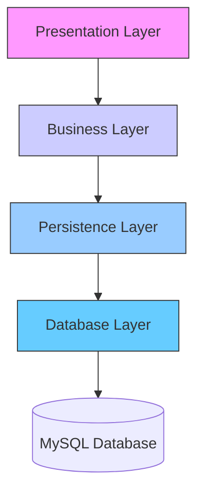

# 🧑‍🍳 Culinary Academy - Layered Architecture Masterpiece


> **Where Code Meets Cuisine!** A sophisticated educational platform built with clean architecture principles, serving knowledge in perfectly layered portions.


## 🎯 Project Overview

Culinary Academy is a comprehensive educational platform designed to manage cooking courses, student registrations, and culinary resources. Built with meticulous attention to software architecture principles, this project demonstrates professional-grade backend development.

## 🏗️ Architectural Excellence



### Our Clean Layers:

- **🍳 Presentation Layer**: Handles HTTP requests, REST API endpoints, and user interaction
- **👨‍🍳 Business Layer**: Contains service classes with core application logic and validation
- **📚 Persistence Layer**: Manages database operations and entity relationships
- **🗄️ Database Layer**: MySQL database with optimized schema design

## ✨ Key Features

| Feature | Description | Status |
|---------|-------------|--------|
| **Course Management** | Create, read, update, and delete cooking courses | ✅ Implemented |
| **Student Registration** | User enrollment and profile management | ✅ Implemented |
| **Resource Library** | Manage recipes, videos, and learning materials | ✅ Implemented |
| **RESTful API** | Clean endpoints for frontend communication | ✅ Implemented |
| **Database Integration** | MySQL with efficient ORM management | ✅ Implemented |

## 🛠️ Technology Stack

### Backend Framework


### Database


### Development Tools


## 🚀 Getting Started

### Prerequisites

- Java 17 or higher
- Maven 3.6+
- MySQL 8.0+
- Your favorite IDE (IntelliJ IDEA recommended)

### Installation

1. **Clone the repository**
   ```bash
   git clone https://github.com/smadhuranga/Culinary-Academy-layerd.git
   cd Culinary-Academy-layerd
   ```

2. **Configure database**
   ```bash
   # Create MySQL database
   CREATE DATABASE culinary_academy;
   
   # Update application.properties with your credentials
   spring.datasource.url=jdbc:mysql://localhost:3306/culinary_academy
   spring.datasource.username=your_username
   spring.datasource.password=your_password
   ```

3. **Build and run**
   ```bash
   mvn clean install
   mvn spring-boot:run
   ```

4. **Access the application**
   ```
   http://localhost:8080
   ```

## 📁 Project Structure

```
Culinary-Academy-layerd/
├── src/main/java/
│   └── com/culinary/academy/
│       ├── controller/       # 🎮 Presentation layer - REST controllers
│       ├── service/          # 👨‍🍳 Business layer - Service implementations
│       ├── repository/       # 📚 Persistence layer - Data access objects
│       ├── model/            # 🎭 Entity classes
│       └── config/           # ⚙️ Configuration classes
├── src/main/resources/
│   └── application.properties # Database and application configuration
└── pom.xml                   # Maven dependencies
```

## 🧪 API Endpoints

| Method | Endpoint | Description |
|--------|----------|-------------|
| GET | `/api/courses` | Retrieve all courses |
| POST | `/api/courses` | Create a new course |
| GET | `/api/courses/{id}` | Get course by ID |
| PUT | `/api/courses/{id}` | Update a course |
| DELETE | `/api/courses/{id}` | Delete a course |
| GET | `/api/students` | Retrieve all students |

## 🎨 Demo


*Example of API responses using Postman*

## 🤝 Contributing

We welcome contributions to make our Culinary Academy even better! Please follow these steps:

1. Fork the project
2. Create your feature branch (`git checkout -b feature/AmazingFeature`)
3. Commit your changes (`git commit -m 'Add some AmazingFeature'`)
4. Push to the branch (`git push origin feature/AmazingFeature`)
5. Open a Pull Request

## 📝 License

This project is licensed under the MIT License - see the [LICENSE.md](LICENSE.md) file for details.

## 👨‍💻 Developer

**Supun Madhuranga** - *Software Artisan & Architecture Chef*

[](https://github.com/smadhuranga)
[](https://linkedin.com/in/your-profile)
[](https://yourportfolio.com)

---

**⭐ Star this repo if you found the architecture delicious! ⭐**

*"Good software, like good food, requires the right ingredients and proper layering."* 🍳
